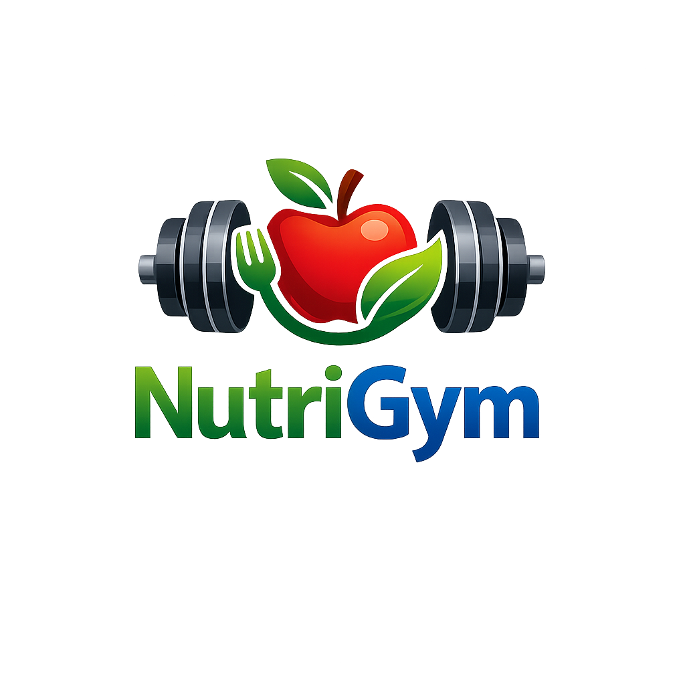

<!-- _class: capa -->



# NutriGym

## Aplicativo de cardápios personalizados em **Flutter**

Cadastro de usuários e alimentos • montagem de cardápios • consulta • compartilhamento

*Trabalho em grupo — Engenharia de Software*

---

## 📌 O que é o NutriGym?

Um aplicativo **mobile/web/desktop** desenvolvido em **Flutter (Dart)** para organizar a alimentação:

- Cada **usuário** tem nome, foto, data de nascimento e gênero
- Cadastra-se uma **base de alimentos** (com tipo e categoria opcional)
- Monta-se **cardápios** ligando alimentos às refeições (café, almoço e janta)
- Permite **consultar**, **compartilhar** e gerencia **login com persistência**

> Os dados ficam salvos num **banco SQLite local** — nada se perde ao fechar o app.

---

## ✨ Funcionalidades

| Módulo | O que faz |
|---|---|
| 🔐 **Login** | Entrar ou criar conta; se já logado, vai direto à tela principal |
| 🏠 **Tela Principal** | Apresentação, acesso aos módulos e logout |
| ➕ **Cadastro** | Novo usuário, novo alimento, novo cardápio |
| 🔎 **Consulta** | Busca de usuário (idade), alimento e cardápio |
| 📤 **Compartilhamento** | Gera link fictício copiável de alimentos e cardápios |
| 👥 **Créditos** | Integrantes do grupo |

---

## 🧭 Fluxo de navegação

```text
        ┌──────────────┐   já logado?   ┌────────────────┐
        │  LoginScreen │ ─────────────► │   HomeScreen   │
        │ entrar/criar │                │ (Tela Principal)│
        └──────────────┘                └───────┬────────┘
                                                 │
        ┌──────────────┬───────────────┬─────────┴───────┐
        ▼              ▼               ▼                 ▼
   Cadastro        Consulta     Compartilhamento     Créditos
   (3 telas)       (3 telas)     (modal de link)
```

Ao **criar uma conta**, um **usuário já é cadastrado automaticamente** — o cliente não precisa criá-lo depois.

---

## 📁 Estrutura de pastas

```text
lib/
├── main.dart                  # Inicializa o banco e decide Login x Home
├── models/                    # Modelos de dados
│   ├── usuario.dart           #   Usuario + enum Genero + cálculo de idade
│   ├── alimento.dart          #   Alimento + enums Categoria/Tipo
│   └── cardapio.dart          #   Cardapio (café, almoço, janta)
├── services/                  # Regras e persistência
│   ├── app_store.dart         #   Estado central (ChangeNotifier) + CRUD
│   ├── database_helper.dart   #   SQLite multiplataforma
│   └── formatador.dart        #   Formatação de texto
├── screens/                   # Telas (UI)
│   ├── login_screen.dart   home_screen.dart   creditos_screen.dart
│   ├── compartilhamento_screen.dart
│   ├── cadastro/  (hub, usuário, alimento, cardápio)
│   └── consulta/  (hub, usuário, alimento, cardápio)
└── widgets/                   # Componentes reutilizáveis
    ├── foto_avatar.dart   └── seletor_foto.dart
```

---

## 🏗️ Como funciona — arquitetura em camadas

<div class="twocol">
<div class="desc">

**1. Models** — estruturas de dados puras (`Usuario`, `Alimento`, `Cardapio`) com `toMap`/`fromMap` para o banco.

**2. Services** — `AppStore` (um `ChangeNotifier` singleton) guarda o estado e fala com o `DatabaseHelper` (SQLite).

**3. Screens / Widgets** — a interface escuta o `AppStore` com `AnimatedBuilder` e se atualiza sozinha.

</div>
<div>

```text
┌─────────────────────────┐
│   Screens  +  Widgets   │  UI
└───────────┬─────────────┘
            │ escuta (notifyListeners)
┌───────────▼─────────────┐
│   AppStore (estado)     │  Lógica
└───────────┬─────────────┘
            │ SQL
┌───────────▼─────────────┐
│   DatabaseHelper        │  Dados
│   SQLite (nutrigym.db)  │
└─────────────────────────┘
```

</div>
</div>

---

## 🗄️ Banco de dados — SQLite multiplataforma

Tabelas: **`contas`**, **`usuarios`**, **`alimentos`**, **`cardapios`**.

O `DatabaseHelper` escolhe o motor certo conforme a plataforma:

```dart
DatabaseFactory _factoryDaPlataforma() {
  if (kIsWeb) return databaseFactoryFfiWeb;          // Web (Chrome)
  switch (defaultTargetPlatform) {
    case TargetPlatform.android:
    case TargetPlatform.iOS:
      return databaseFactory;                        // Mobile (sqflite)
    default:
      sqfliteFfiInit();
      return databaseFactoryFfi;                     // Linux/Windows/macOS
  }
}
```

> Apenas a **sessão de login** fica em `SharedPreferences`; o resto é tudo SQLite.

---

## 🔐 Tela de Login

<div class="twocol">
<div>
<div class="phone">
  <div class="body">
    <div class="logo-c"></div>
    <div style="text-align:center;color:#777;font-size:13px;">Crie a sua conta</div>
    <div class="field">👤 Nome completo</div>
    <div class="field">🎂 Data de nascimento</div>
    <div class="field">⚧ Gênero</div>
    <div class="field">✉️ E-mail</div>
    <div class="field">🔒 Senha</div>
    <div class="btn">Criar conta</div>
    <div style="text-align:center;color:#1565c0;font-size:12px;margin-top:8px;">Já tenho conta. Entrar</div>
  </div>
</div>
</div>
<div class="desc">

- Alterna entre **Entrar** e **Criar conta**
- Na criação, coleta **nome, data de nascimento e gênero**
- Ao criar a conta, **gera o usuário automaticamente**
- Se o login já estiver salvo, o app abre **direto na tela principal**

</div>
</div>

---

## 🏠 Tela Principal

<div class="twocol">
<div>
<div class="phone">
  <div class="bar"><span>NutriGym</span><span>⎋</span></div>
  <div class="body">
    <div class="logo-c"></div>
    <div class="card-v">➕ Cadastro de itens<small>Usuários, alimentos e cardápios</small></div>
    <div class="card-v">🔎 Consulta de itens<small>Pesquise usuários e alimentos</small></div>
    <div class="card-v">📤 Compartilhamento<small>Alimentos e cardápios</small></div>
    <div class="card-v">👥 Créditos<small>Integrantes do grupo</small></div>
  </div>
</div>
</div>
<div class="desc">

- **Header verde** com título branco e botão de **logout**
- **Logo** em destaque (apresentação do app)
- Cards **verdes** com texto e ícones brancos
- Cada card leva a um módulo do app

</div>
</div>

---

## ➕ Cadastro — Novo Cardápio (campos dinâmicos)

<div class="twocol">
<div>
<div class="phone">
  <div class="bar"><span>Novo Cardápio</span></div>
  <div class="body">
    <div class="field">👤 Usuário ▾</div>
    <div style="border:1px solid #ddd;border-radius:8px;padding:8px;margin:6px 0;">
      <b style="font-size:13px;">☕ Café da manhã (2) <span style="float:right;background:var(--verde);color:#fff;border-radius:6px;padding:0 7px;">+</span></b>
      <div class="field">Opção 1 ▾ ⊖</div>
      <div class="field">Opção 2 ▾ ⊖</div>
    </div>
    <div style="border:1px solid #ddd;border-radius:8px;padding:8px;margin:6px 0;">
      <b style="font-size:13px;">🍽️ Almoço (1) <span style="float:right;background:var(--verde);color:#fff;border-radius:6px;padding:0 7px;">+</span></b>
    </div>
    <div class="btn">Salvar cardápio</div>
  </div>
</div>
</div>
<div class="desc">

- Escolhe um **usuário** já cadastrado
- Cada refeição (café/almoço/janta) tem um botão **"+"** para **adicionar opções** sob demanda
- Cada opção pode ser **removida** (⊖)
- As opções vêm dos **alimentos cadastrados**

</div>
</div>

---

## 🔎 Consulta & 📤 Compartilhamento

<div class="twocol">
<div class="desc">

### Consulta
- **Usuário** pelo nome → nome, foto e **idade** (calculada pela data de nascimento)
- **Alimento** pelo nome → nome, foto, categoria, tipo
- **Cardápio** pelo nome do usuário → opções de cada refeição

</div>
<div class="desc">

### Compartilhamento
Ao tocar no ícone 📤, abre um **modal** com um **link fictício copiável**:

<div class="modal">
<b>Compartilhar Maçã</b><br>
Use o link abaixo:
<span class="link">https://nutrigym.app/alimento/a1b2c3d4</span>
<span style="background:var(--verde);color:#fff;padding:4px 10px;border-radius:6px;">📋 Copiar link</span>
</div>

</div>
</div>

---

## 👥 Tela de Créditos

<div class="twocol">
<div>
<div class="phone">
  <div class="bar"><span>Créditos</span></div>
  <div class="body">
    <div class="card-v" style="justify-content:center;">👥 Integrantes do grupo</div>
    <div class="field">👤 Bruno Vinicius Carvalho de Alencar</div>
    <div class="field">👤 Felipe de Arena Abreu Ramos Figueiredo</div>
    <div class="field">👤 João Victor Mesquita de Moraes Toledo</div>
    <div class="field">👤 Lucas da Silva Lima</div>
    <div class="field">👤 Rafael de Araújo Moreira</div>
  </div>
</div>
</div>
<div class="desc">

A tela lista o **nome completo** de todos os integrantes do grupo responsáveis pelo desenvolvimento do NutriGym.

</div>
</div>

---

## 💻 Partes do código — cálculo da idade

`models/usuario.dart` — a idade é derivada da data de nascimento:

```dart
int get idade {
  final hoje = DateTime.now();
  var anos = hoje.year - dataNascimento.year;
  final aindaNaoFezAniversario = hoje.month < dataNascimento.month ||
      (hoje.month == dataNascimento.month && hoje.day < dataNascimento.day);
  if (aindaNaoFezAniversario) anos--;
  return anos;
}
```

---

## 💻 Partes do código — conta cria usuário

`services/app_store.dart` — ao registrar, a conta **e** o usuário são gravados:

```dart
Future<String?> registrar({ required String email, required String senha,
    required String nome, required DateTime dataNascimento,
    required Genero genero }) async {
  final chave = email.trim().toLowerCase();
  if (_credenciais.containsKey(chave)) return 'Já existe uma conta...';

  await _db!.insert('contas', {'email': chave, 'senha': senha});
  _credenciais[chave] = senha;

  // Ao criar a conta, já cadastra o usuário correspondente:
  await adicionarUsuario(nome: nome, dataNascimento: dataNascimento, genero: genero);
  return entrar(email, senha);
}
```

---

## 💻 Partes do código — gravando no SQLite

`services/app_store.dart` — inserir e manter o cache em memória:

```dart
Future<void> adicionarUsuario({ required String nome,
    required DateTime dataNascimento, required Genero genero,
    String? fotoPath }) async {
  final usuario = Usuario(
    id: _uuid.v4(), nome: nome,
    dataNascimento: dataNascimento, genero: genero, fotoPath: fotoPath,
  );
  await _db!.insert('usuarios', usuario.toMap());  // persiste no banco
  _usuarios.add(usuario);                          // atualiza cache
  notifyListeners();                               // avisa a interface
}
```

---

## 📦 Dependências (pubspec.yaml)

| Pacote | Para quê |
|---|---|
| `sqflite` / `sqflite_common_ffi` / `_ffi_web` | Banco **SQLite** em mobile, desktop e web |
| `shared_preferences` | Guardar a **sessão de login** |
| `image_picker` | Escolher **foto** (câmera/galeria) |
| `uuid` | Gerar **IDs únicos** dos registros |
| `path` | Montar o caminho do arquivo do banco |
| `cupertino_icons` | Ícones |

---

## ▶️ Como rodar o projeto

**Pré-requisitos:** Flutter SDK instalado (`flutter doctor`).

```bash
# 1. Instalar as dependências
flutter pub get

# 2. (uma vez) preparar o SQLite para a web
dart run sqflite_common_ffi_web:setup

# 3. Rodar — escolha o dispositivo:
flutter run -d chrome     # navegador (web)
flutter run -d linux      # janela desktop Linux
flutter run               # pergunta o dispositivo (ex.: Android)
```

No **VSCode**: selecione o dispositivo na barra inferior e pressione **F5**.
Durante a execução: **`r`** = hot reload, **`R`** = restart, **`q`** = sair.

---

## ✅ Resumo técnico

- **Flutter + Dart**, Material 3, tema **verde**
- **~1.300 linhas** organizadas em camadas (models / services / screens / widgets)
- Estado reativo com **`ChangeNotifier`** + `AnimatedBuilder`
- Persistência real em **SQLite** (multiplataforma)
- Login com sessão, **6 telas** principais e componentes reutilizáveis
- Funciona em **Android, iOS, Web, Linux, Windows e macOS**

---

<!-- _class: capa -->


# Obrigado! 🥗

## NutriGym — alimentação organizada

**Bruno Alencar • Felipe Figueiredo • João Toledo • Lucas Lima • Rafael Moreira**
